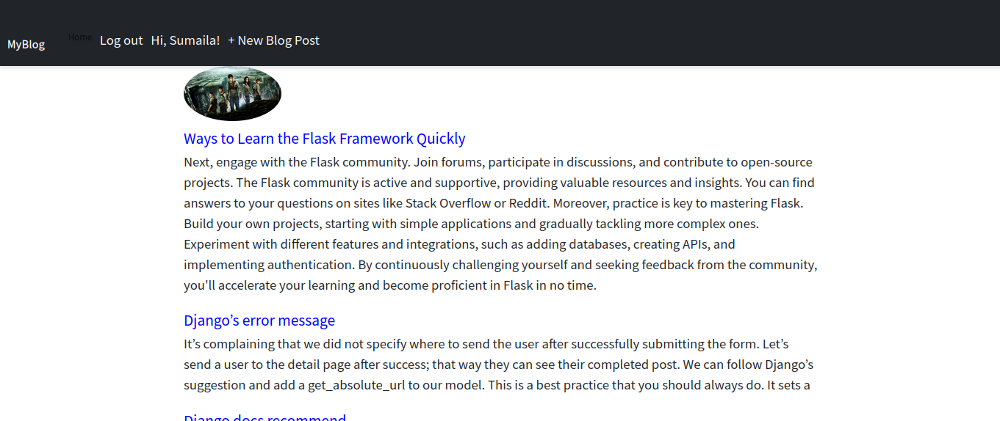
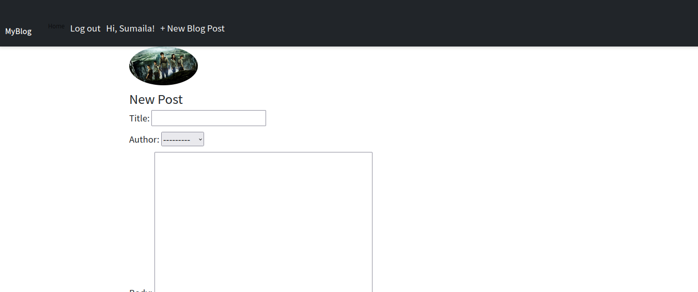
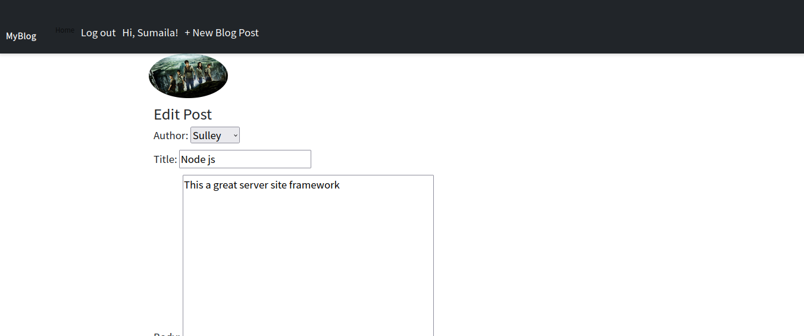

# My Django Blog Application

## 🌟 Overview

Welcome to my Django Blog Application! This platform empowers users to share their thoughts, experiences, and stories through blog posts. Whether you want to express yourself, share knowledge, or connect with others, this application provides a seamless experience for content creation and management.

## 🚀 Key Features







- **🔐 User Authentication**
  - **Login**: Secure login functionality to protect user accounts and personal data.
  - **Signup**: Easy and intuitive registration process, enabling new users to join the community quickly.

- **✏️ Content Management**
  - **Add New Post**: Effortlessly create and publish new blog posts with rich content.
  - **Edit Post**: Make updates to your posts at any time, ensuring your content remains current and accurate.
  - **Delete Post**: Remove posts that are no longer relevant or needed with a simple click.

## 🎯 Importance of This Application

### 1. **User-Friendly Experience**
This application prioritizes ease of use, ensuring that both tech-savvy individuals and beginners can navigate the platform and share content without hassle.

### 2. **Security**
With built-in user authentication features, the application ensures that your data is secure and accessible only to authorized users.

### 3. **Content Control**
Empowering users to manage their content is at the heart of this application. The ability to edit and delete posts ensures that users can maintain control over their published material.

### 4. **Community Engagement**
By providing a platform for users to share their posts, the application fosters a community of like-minded individuals who can interact, learn, and grow together.

## 🛠️ Tech Stack

- **Django**: A high-level Python web framework that encourages rapid development and clean, pragmatic design.
- **Bootstrap**: For responsive and visually appealing UI components.
- **SQLite/PostgreSQL**: As the database for storing user data and blog posts.

## 📈 Future Enhancements

- **Commenting System**: Allow users to engage with posts by adding comments.
- **Search Functionality**: Enable users to search for specific posts or topics.
- **User Profiles**: Provide personalized user profiles to showcase individual posts and contributions.

## 🎉 Get Started

To run this project locally:

1. Clone the repository:
   ```bash
   git clone https://github.com/AyambaSumaila/django-blog-app.git


Navigate to the project directory:

bash

cd django-blog-app

Install dependencies:

bash

pip install -r requirements.txt

Apply migrations:

bash

python manage.py migrate

Run the development server:

bash

    python manage.py runserver

    Access the application at http://localhost:8000.

🙏 Contributing

Contributions are welcome! Please feel free to submit a pull request or open an issue to discuss any changes.
📄 License

This project is licensed under the MIT License. See the LICENSE file for more details.
